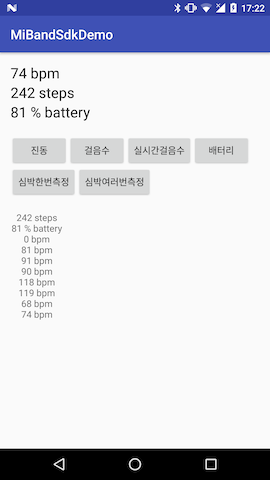

# MiBand SDK [  ](https://bintray.com/iyeonghun/maven/miband-sdk/_latestVersion)

이전에 개발되어있던 [panglian/miband-sdk-android](https://github.com/pangliang/miband-sdk-android) 라이브러리가 더이상 유지보수가 안되고 연결상의 문제가 있어 이전 라이브러리 구조 기반으로 다시 만든 Mi Band 라이브러리 입니다. · 
Based on the no-longer-maintained [panglian/miband-sdk-android] (https://github.com/pangliang/miband-sdk-android)

#### To-do list

- Library Structure edit
- MiBand 1 Connection code edit
- MiBand 1 HR code edit
- Make MiBand 2 HR code
- Make MiBand 2 Activity code

## Description



Mi Band 를 사용하기 위한 Android 라이브러리 입니다. Android 버전 21부터 사용 가능합니다. · Android API version 21 required.

현재 아래와 같은 기능이 구현되어 있으며 추후 다른 기능들을 추가 할 예정 입니다. · The following functions are currently implemented:

- 심박수 측정(1번, 약 10번 연속) · Heart rate
- Led, 진동 알람 · LED, virbating alarm
- 현재 걸음수 측정 · Pedometer
- 실시간 걸음수 측정 · Real-time step events
- 배터리 잔량 확인 · Battery charge level

## Installation

app의 `build.gradle`파일에 다음과 같이 추가 합니다. · Add the following to build.gradle:

```groovy
compile 'com.jellygom:miband-sdk:0.2.1'
```

## Usage

> Miband 연결은 Xiaomi 공식 어플리케이션인 Mi Fit 에서 스마트폰과 페어링을 해야 하며 아래 동작을 1회 수행하여야 합니다. · Mi Band must be paired in the Mi Fit official application
>
> Mi Fit 어플리케이션에서 기기 연결 후 심박 체크를 한번 해야 합니다. · Set your application to be used every heartbeat

1. Miband 클래스를 생성합니다. · Create a Mi Band class

   ```java
   Miband miband = new Miband(getApplicationContext());
   ```

2. 스마트폰의 BluetoothAdapter를 받아와 `searchDevice()`의 매개변수에 넣어  `BluetoothDevice`를 받아옵니다. · Use `searchDevice()` on `BluetoothAdapter`

   ```java
   BluetoothAdapter bluetoothAdapter = ((BluetoothManager)getSystemService(Context.BLUETOOTH_SERVICE)).getAdapter();

   miband.searchDevice(bluetoothAdapter, new MibandCallback() {
     @Override
     public void onSuccess(Object data, int status) {
       // data == 연결될 미밴드 BluetoothDevice
     }

     @Override
     public void onFail(int errorCode, String msg, int status) {

     }
   });
   ```

3. `connect()`를 통하여 미밴드와 연결 합니다. `setDisconnectedListener()`를 통하여 미밴드와 연결이 해제 되었을때를 알아 올수 있습니다. · Connect to Mi Band using `connect()`.  User `setDisconnectedListener()` to listen for disconnection events.

   ```java
   miband.connect(/*Bluetooth Device*/, new MibandCallback() {
     @Override
     public void onSuccess(Object data, int status) {

     }

     @Override
     public void onFail(int errorCode, String msg, int status) {

     }
   });

   miband.setDisconnectedListener(new NotifyListener() {
     @Override
     public void onNotify(byte[] data) {
       // data == null
     }
   });
   ```

4. `getUserInfo()`와 `setUserInfo()`를 수행하여 심박값을 가져 올수 있게 합니다. 이 동작은 심박값을 가져오기 위해서는 반드시 먼저 이루어져야 합니다. · `getUserInfo()` and/or `setUserInfo()` (as applicable) must be used before heart rate data is readable.

   ```java
   miband.getUserInfo(new MibandCallback() {
     @Override
     public void onSuccess(Object data, int status) {
       // data == 사용자 정보 BluetoothGattCharacteristic 값, byte 배열로 받은 후 UserInfo로 변환한다
       // UserInfo userInfo = new UserInfo().fromByteData(((BluetoothGattCharacteristic) data).getValue());
     }

     @Override
     public void onFail(int errorCode, String msg, int status) {

     }
   });

   miband.setUserInfo(/*UserInfo*/, new MibandCallback() {
     @Override
     public void onSuccess(Object data, int status) {

     }

     @Override
     public void onFail(int errorCode, String msg, int status) {

     }
   });
   ```

5. Miband에 동작을 수행하게 하는 메소드 입니다. · Example Mi Band usage:

   1. `startHeartRateScan()`은 리스너를 먼저 등록 해두어야 합니다. 리스너를 통하여 값을 받아오기 때문입니다. · Register a listener first
   2. 그 외에는 리스너 없이 작동 합니다. · Subsequent heart rate calls work without any listeners

   ```java
   // Led + 진동 알림 · LED + vibrating alert
   miband.sendAlert(new MibandCallback() {
     @Override
     public void onSuccess(Object data, int status) {
   	// data == null
     }

     @Override
     public void onFail(int errorCode, String msg, int status) {

     }
   });
   // 심박수 체크 약 10회 (정확히 몇번 나오는지 알수 없음) · Check heart rate about 10 times
   miband.startHeartRateScan(0, new MibandCallback() {
     @Override
     public void onSuccess(Object data, int status) {
   	// data == null
     }

     @Override
     public void onFail(int errorCode, String msg, int status) {

     }
   });
   // 심박수 체크 1회 · Check heart rate once
   miband.startHeartRateScan(1, new MibandCallback() {
     @Override
     public void onSuccess(Object data, int status) {
   	// data == null
     }

     @Override
     public void onFail(int errorCode, String msg, int status) {

     }
   });
   // 현재 걸음수 · Get current steps
   miband.getCurrentSteps(new MibandCallback() {
     @Override
     public void onSuccess(Object data, int status) {
       int steps = (int) data;
     }

     @Override
     public void onFail(int errorCode, String msg, int status) {

     }
   });
   // 현재 배터리 잔량 · Check battery level
   miband.getBatteryLevel(new MibandCallback() {
     @Override
     public void onSuccess(Object data, int status) {
       int batteryLevel = (int) data;
     }

     @Override
     public void onFail(int errorCode, String msg, int status) {

     }
   });
   ```

6. 각 리스너를 등록하여 알맞는 값을 가져올수 있게 됩니다. · Registered listeners will populate the listener with their value, which can be accessed at any time

   1. `setRealtimeStepListener()`는 다른것 없이 작동 합니다. · Will work without registration

   ```java
   // 심박수 · Heart rate
   miband.setHeartRateScanListener(new HeartrateListener() {
     @Override
     public void onNotify(int heartRate) {

     }
   });
   // 실시간 걸음수 · Pedometer
   miband.setRealtimeStepListener(new RealtimeStepListener() {
     @Override
     public void onNotify(int steps) {

     }
   });
   ```

#### Tip

Miband Callback 은 아래와 코드처럼 하나만 생성하여 통합 관리도 가능합니다. · Mi Band callbacks produce a single return, as follows:

```java
private final MibandCallback mibandCallback = new MibandCallback() {
  @Override
  public void onSuccess(Object data, int status) {
    switch (status) {
      case MibandCallback.STATUS_SEARCH_DEVICE:
        Log.e(TAG, "성공: STATUS_SEARCH_DEVICE");
        break;
      case MibandCallback.STATUS_CONNECT:
        Log.e(TAG, "성공: STATUS_CONNECT");
        break;
      case MibandCallback.STATUS_SEND_ALERT:
        Log.e(TAG, "성공: STATUS_SEND_ALERT");
        break;
      case MibandCallback.STATUS_GET_USERINFO:
        Log.e(TAG, "성공: STATUS_GET_USERINFO");
        break;
      case MibandCallback.STATUS_SET_USERINFO:
        Log.e(TAG, "성공: STATUS_SET_USERINFO");
        break;
      case MibandCallback.STATUS_START_HEARTRATE_SCAN:
        Log.e(TAG, "성공: STATUS_START_HEARTRATE_SCAN");
        break;
      case MibandCallback.STATUS_GET_BATTERY:
        Log.e(TAG, "성공: STATUS_GET_BATTERY");
        int level = (int) data;
        break;
      case MibandCallback.STATUS_GET_ACTIVITY_DATA:
        Log.e(TAG, "성공: STATUS_GET_ACTIVITY_DATA");
        int steps = (int) data;
        break;
    }
  }

  @Override
  public void onFail(int errorCode, String msg, int status) {
    switch (status) {
      case MibandCallback.STATUS_SEARCH_DEVICE:
        Log.e(TAG, "실패: STATUS_SEARCH_DEVICE");
        break;
      case MibandCallback.STATUS_CONNECT:
        Log.e(TAG, "실패: STATUS_CONNECT");
        break;
      case MibandCallback.STATUS_SEND_ALERT:
        Log.e(TAG, "실패: STATUS_SEND_ALERT");
        break;
      case MibandCallback.STATUS_GET_USERINFO:
        Log.e(TAG, "실패: STATUS_GET_USERINFO");
        break;
      case MibandCallback.STATUS_SET_USERINFO:
        Log.e(TAG, "실패: STATUS_SET_USERINFO");
        break;
      case MibandCallback.STATUS_START_HEARTRATE_SCAN:
        Log.e(TAG, "실패: STATUS_START_HEARTRATE_SCAN");
        break;
      case MibandCallback.STATUS_GET_BATTERY:
        Log.e(TAG, "실패: STATUS_GET_BATTERY");
        break;
      case MibandCallback.STATUS_GET_ACTIVITY_DATA:
        Log.e(TAG, "실패: STATUS_GET_ACTIVITY_DATA");
        break;
    }
  }
};
```

## Release Notes

#### [v0.2.1 - 2016.09.20](https://github.com/Iyeonghun/MiBandSdk/releases/tag/v0.2.1)

- 미밴드와 연결이 끊김 확인용 리스너 생성 · Creating a listener for checking the connection breaks for US bands

#### [v0.2 - 2016.09.19](https://github.com/Iyeonghun/MiBandSdk/releases/tag/v0.2.0)
- 현재 배터리 잔량을 가져 올 수 있게 되었다. · Battery level
- 오늘 현재 걸음수 및 실시간으로 걸음수를 가져 올 수 있게 되었다. · Pedometer
- 예제 앱 변경 · Sample app changes

#### [v0.1 - 2016.09.04](https://github.com/Iyeonghun/MiBandSdk/releases/tag/v0.1.0)

- Mi Band 1S 연결 API 재작성 · Mi Band 1S Connect API corrections
- Mi Band를 흔들지 않아도 심박 측정가능 · Heart rate can be measured without shaking the band
  - [이전 라이브러리](https://github.com/pangliang/miband-sdk-android)에서 심박 측정 전 setUserInfo를 하게되면 Mi Band를 실제 연결 하는것처럼 Mi Band를 흔들어야 했었다. · Before the band had to be shaken to return heart rate info.
- Mi Band에 기록된 UserInfo를 가져올 수 있다 · UserInfo functions added
- 모든 API에 CallBack을 통해 각 API가 종료 되었는지 확인 가능 · Added API exit callback

## License

```
Copyright 2016 Lee,YeoungHun

Licensed under the Apache License, Version 2.0 (the "License");
you may not use this file except in compliance with the License.
You may obtain a copy of the License at

	http://www.apache.org/licenses/LICENSE-2.0

Unless required by applicable law or agreed to in writing, software
distributed under the License is distributed on an "AS IS" BASIS,
WITHOUT WARRANTIES OR CONDITIONS OF ANY KIND, either express or implied.
See the License for the specific language governing permissions and
limitations under the License.
```

